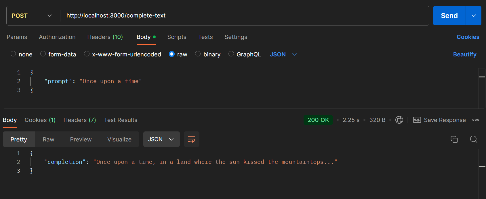

# Getting Started

To run this project locally, follow the steps below:

### 1. Clone the repository

Clone the repository to your local machine by running the following command:

```bash
git clone https://github.com/GautamSh30/CollegeIt.git
```

### 2. Open the project

Navigate to the project directory:

```bash
cd CollegeIt
```

### 3. Install dependencies

Before running the project, install the necessary dependencies using npm:

```bash
npm install
```

### 4. Set up environment variables

Create a .env file in the root directory and configure the following environment variables:

```bash
PORT=3000
```

If you are using openai api then use -

```bash
OPENAI_API_KEY=your-openai-api-key
```

If you are using gemini api then use -

```bash
GEMINI_API_KEY=your-gemini-api-key
```

If you're facing any problem then feel free to use my api_key

### 5. Run the development server

Start the server by running:

```bash
npm start
```

The application will be running on http://localhost:3000.

# Screenshot


